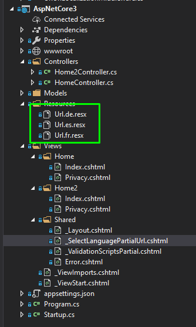
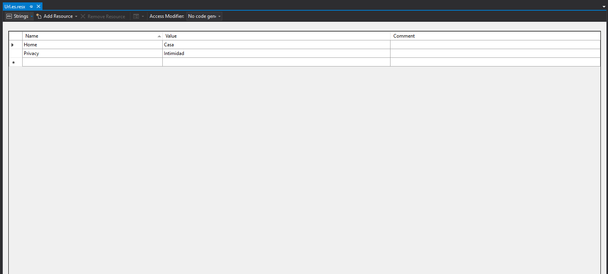

# ASP.NET Core Url Localization

[](https://www.nuget.org/packages/AspNetCore.Mvc.UrlLocalization/) 

By default ASP.NET comes with support for [Globalization and Localization](https://docs.microsoft.com/en-us/aspnet/core/fundamentals/localization?view=aspnetcore-2.2) 
* Formatting - (Dates, Currencies, Numbers) - CultureInfo.CurrentCulture 
* Resource Localization via Resx files - CultureInfo.CurrentUICulture

The aim of this package is to build on top of Resource Localization to provide Url Localization (Link Generation) and Unlocalization (Request Processing) via files named Url.{culture}.resx. Unlocalized routes will continue to work for any culture until a localization is provided. For example /privacy would initially also work for /es/privacy also. Once a url route was included in Url.es.resx for 'Privacy' > 'Intimidad' the middleware (by default) would redirect /es/privacy > /es/intimidad. This functionality can be changed so a 404 is returned or the request is still processed. Inject IUrlLocalizer into views to localize link text, often the link text is the same as the url route so in that case only one replacement would need to be added.





## Installation

### NuGet
```
PM> Install-Package AspNetCore.Mvc.UrlLocalization
```

### .Net CLI
```
> dotnet add package AspNetCore.Mvc.UrlLocalization
```

## Examples
* See Examples\AspNetCore3
* See Examples\AspNetCore2.2
* See Examples\AspNetCore2.2FullFramework

## Quick Start ASP.NET Core 3.0
```
public class Startup
{
	public Startup(IConfiguration configuration)
	{
		Configuration = configuration;
	}

	public IConfiguration Configuration { get; }

	public bool RedirectCulturelessToDefaultCulture = false;

	// This method gets called by the runtime. Use this method to add services to the container.
	public void ConfigureServices(IServiceCollection services)
	{
		services.AddLocalization(options => options.ResourcesPath = "Resources");
		services.AddUrlLocalization();

		services.AddCultureRouteConstraint("cultureCheck");

		services.AddControllersWithViews(options =>
		{
			//Adds {culture:cultureCheck} to ALL routes
			if (RedirectCulturelessToDefaultCulture)
				options.AddCultureAttributeRouteConvention("culture", "cultureCheck");
			else
				options.AddOptionalCultureAttributeRouteConvention("culture", "cultureCheck");

			//options.Filters.Add(new MvcUrlLocalizationFilterAttribute());
		})
		.AddViewLocalization(LanguageViewLocationExpanderFormat.Suffix)
		.AddDataAnnotationsLocalization()
		.AddActionLinkLocalization()
		.AddAmbientRouteDataUrlHelperFactory(options =>
		{
			options.AmbientRouteDataKeys.Add(new AmbientRouteDataKey("area", false));
			options.AmbientRouteDataKeys.Add(new AmbientRouteDataKey("culture", true));
			options.AmbientRouteDataKeys.Add(new AmbientRouteDataKey("ui-culture", true));
		});

		var supportedCultures = new[]
		 {
			new CultureInfo("en-US"),
			new CultureInfo("es"),
			new CultureInfo("fr"),
			new CultureInfo("de")
		};

		services.Configure<RequestLocalizationOptions>(options =>
		{
			options.DefaultRequestCulture = new RequestCulture("en-US");
			// Formatting numbers, dates, etc.
			options.SupportedCultures = supportedCultures;
			// UI strings that we have localized.
			options.SupportedUICultures = supportedCultures;
			options.RequestCultureProviders = new List<IRequestCultureProvider>()
			{
				 new RouteDataRequestCultureProvider() { Options = options, RouteDataStringKey = "culture", UIRouteDataStringKey = "ui-culture" },
				 new UrlRequestCultureProvider(),
				 new QueryStringRequestCultureProvider() { QueryStringKey = "culture", UIQueryStringKey = "ui-culture" },
				 new CookieRequestCultureProvider(),
				 new AcceptLanguageHeaderRequestCultureProvider(),
			};
		});

		services.AddSingleton(sp => sp.GetService<IOptions<RequestLocalizationOptions>>().Value);

		services.Configure<RedirectUnsupportedUrlCulturesOptions>(options =>
		{
			options.RedirectUnspportedCulturesToDefaultCulture = true;
			options.RedirectCulturelessToDefaultCulture = RedirectCulturelessToDefaultCulture;
		});

		services.AddSingleton(sp => sp.GetService<IOptions<RedirectUnsupportedUrlCulturesOptions>>().Value);

		services.Configure<RouteOptions>(options => options.LowercaseUrls = true);
	}

	// This method gets called by the runtime. Use this method to configure the HTTP request pipeline.
	public void Configure(IApplicationBuilder app, IWebHostEnvironment env, RequestLocalizationOptions localizationOptions, RedirectUnsupportedUrlCulturesOptions redirectUnsupportedUrlCulturesOptions)
	{
		if (env.IsDevelopment())
		{
			app.UseDeveloperExceptionPage();
		}
		else
		{
			app.UseExceptionHandler("/Home/Error");
			// The default HSTS value is 30 days. You may want to change this for production scenarios, see https://aka.ms/aspnetcore-hsts.
			app.UseHsts();
		}
		app.UseHttpsRedirection();        

		app.UseStaticFiles();

		app.UseRequestLocalization(localizationOptions);
		app.UseRedirectUnsupportedUrlCultures(redirectUnsupportedUrlCulturesOptions);
		app.UseUrlUnlocalization();

		app.UseRouting();

		app.UseAuthorization();

		app.UseEndpoints(endpoints =>
		{
			if (redirectUnsupportedUrlCulturesOptions.RedirectCulturelessToDefaultCulture)
			{
				endpoints.MapControllerRoute(
				 name: "defaultWithCulture",
				 pattern: "{culture:cultureCheck}/{controller=Home}/{action=Index}/{id?}");

				//Other Routes

				endpoints.RedirectCulturelessToDefaultCulture();
			}
			else
			{
				endpoints.MapControllerRoute(
				name: "default",
				pattern: "{controller=Home}/{action=Index}/{id?}");

				endpoints.MapControllerRoute(
				 name: "defaultWithCulture",
				 pattern: "{culture:cultureCheck}/{controller=Home}/{action=Index}/{id?}");

				//Other Routes
			}
		});
	}
}
```

## Quick Start ASP.NET Core 2.2
```
public class Startup
{
	public Startup(IConfiguration configuration)
	{
		Configuration = configuration;
	}

	public IConfiguration Configuration { get; }

	public bool RedirectCulturelessToDefaultCulture = false;

	// This method gets called by the runtime. Use this method to add services to the container.
	public void ConfigureServices(IServiceCollection services)
	{
		services.Configure<CookiePolicyOptions>(options =>
		{
			// This lambda determines whether user consent for non-essential cookies is needed for a given request.
			options.CheckConsentNeeded = context => true;
			options.MinimumSameSitePolicy = SameSiteMode.None;
		});

		services.AddLocalization(options => options.ResourcesPath = "Resources");
		services.AddUrlLocalization();
		services.AddCultureRouteConstraint("cultureCheck");

		services.AddMvc(options => {
			//Adds {culture:cultureCheck} to ALL routes
			if (RedirectCulturelessToDefaultCulture)
				options.AddCultureAttributeRouteConvention("culture", "cultureCheck");
			else
				options.AddOptionalCultureAttributeRouteConvention("culture", "cultureCheck");

			//options.Filters.Add(new MvcUrlLocalizationFilterAttribute());
		}).SetCompatibilityVersion(CompatibilityVersion.Version_2_2)
		.AddViewLocalization(LanguageViewLocationExpanderFormat.Suffix)
		.AddDataAnnotationsLocalization()
		.AddActionLinkLocalization()
		.AddAmbientRouteDataUrlHelperFactory(options =>
		{
			options.AmbientRouteDataKeys.Add(new AmbientRouteDataKey("area", false));
			options.AmbientRouteDataKeys.Add(new AmbientRouteDataKey("culture", true));
			options.AmbientRouteDataKeys.Add(new AmbientRouteDataKey("ui-culture", true));
		});

		var supportedCultures = new[]
	   {
			new CultureInfo("en-US"),
			new CultureInfo("es"),
			new CultureInfo("fr"),
			new CultureInfo("de")
		};

		services.Configure<RequestLocalizationOptions>(options =>
		{
			options.DefaultRequestCulture = new RequestCulture("en-US");
			// Formatting numbers, dates, etc.
			options.SupportedCultures = supportedCultures;
			// UI strings that we have localized.
			options.SupportedUICultures = supportedCultures;
			options.RequestCultureProviders = new List<IRequestCultureProvider>()
			{
				 new RouteDataRequestCultureProvider() { Options = options, RouteDataStringKey = "culture", UIRouteDataStringKey = "ui-culture" },
				 new UrlRequestCultureProvider(),
				 new QueryStringRequestCultureProvider() { QueryStringKey = "culture", UIQueryStringKey = "ui-culture" },
				 new CookieRequestCultureProvider(),
				 new AcceptLanguageHeaderRequestCultureProvider(),
			};
		});

		services.AddSingleton(sp => sp.GetService<IOptions<RequestLocalizationOptions>>().Value);

		services.Configure<RedirectUnsupportedUrlCulturesOptions>(options =>
		{
			options.RedirectUnspportedCulturesToDefaultCulture = true;
			options.RedirectCulturelessToDefaultCulture = RedirectCulturelessToDefaultCulture;
		});

		services.AddSingleton(sp => sp.GetService<IOptions<RedirectUnsupportedUrlCulturesOptions>>().Value);

		services.Configure<RouteOptions>(options => options.LowercaseUrls = true);
	}

	// This method gets called by the runtime. Use this method to configure the HTTP request pipeline.
	public void Configure(IApplicationBuilder app, IHostingEnvironment env, RequestLocalizationOptions localizationOptions, RedirectUnsupportedUrlCulturesOptions redirectUnsupportedUrlCulturesOptions)
	{
		if (env.IsDevelopment())
		{
			app.UseDeveloperExceptionPage();
		}
		else
		{
			app.UseExceptionHandler("/Home/Error");
			// The default HSTS value is 30 days. You may want to change this for production scenarios, see https://aka.ms/aspnetcore-hsts.
			app.UseHsts();
		}

		app.UseHttpsRedirection();

		app.UseStaticFiles();

		app.UseRequestLocalization(localizationOptions);
		app.UseRedirectUnsupportedUrlCultures(redirectUnsupportedUrlCulturesOptions);
		app.UseUrlUnlocalization();

		app.UseEndpointRouting(); //app.UseRouting()

		app.UseCookiePolicy();

		app.UseMvc(routes =>
		{
			if (redirectUnsupportedUrlCulturesOptions.RedirectCulturelessToDefaultCulture)
			{
				routes.MapRoute(
				 name: "defaultWithCulture",
				 template: "{culture:cultureCheck}/{controller=Home}/{action=Index}/{id?}");

				//Other Routes

				routes.RedirectCulturelessToDefaultCulture();
			}
			else
			{
				routes.MapRoute(
				 name: "default",
				 template: "{controller=Home}/{action=Index}/{id?}");

				routes.MapRoute(
				name: "defaultWithCulture",
				template: "{culture:cultureCheck}/{controller=Home}/{action=Index}/{id?}");

				//Other Routes
			}
		});

	}
}
```

## Authors

* **Dave Ikin** - [davidikin45](https://github.com/davidikin45)

## License

This project is licensed under the MIT License

## Acknowledgments

* [Url culture provider using middleware as filters in ASP.NET Core 1.1.0](https://andrewlock.net/url-culture-provider-using-middleware-as-mvc-filter-in-asp-net-core-1-1-0/)
* [Applying the RouteDataRequest CultureProvider globally with middleware as filters](https://andrewlock.net/applying-the-routedatarequest-cultureprovider-globally-with-middleware-as-filters/)
* [Using a culture constraint and catching 404s with the url culture provider](https://andrewlock.net/using-a-culture-constraint-and-catching-404s-with-the-url-culture-provider/)
* [Redirecting unknown cultures to the default culture when using the url culture provider](https://andrewlock.net/redirecting-unknown-cultures-to-the-default-culture-when-using-the-url-culture-provider/)
* [Localized routes with ASP.NET 5 and MVC 6](https://www.strathweb.com/2015/11/localized-routes-with-asp-net-5-and-mvc-6/)
* [ASP.NET Core 2.1 MVC localized routing](https://github.com/saaratrix/asp.net-core-mvc-localized-routing)
* [Dynamic controller routing in ASP.NET Core 3.0](https://www.strathweb.com/2019/08/dynamic-controller-routing-in-asp-net-core-3-0/)